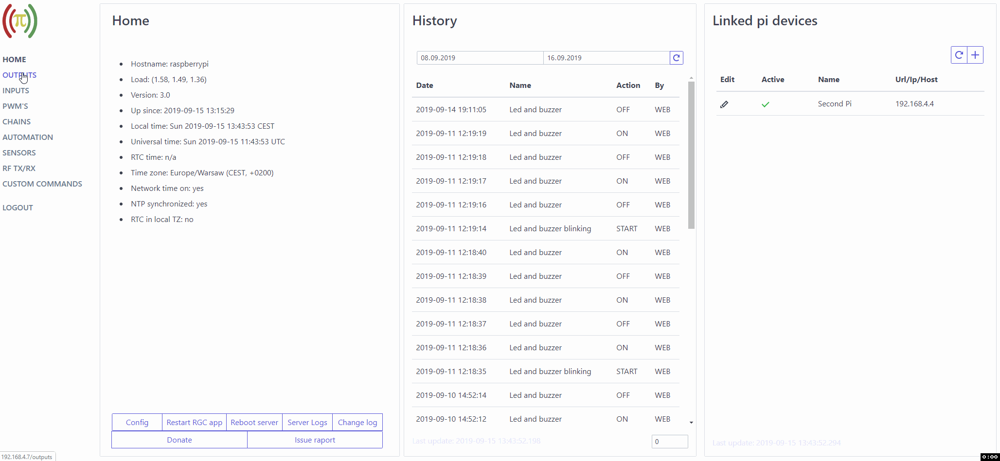

# Remote GPIO control server
Application allows you to control GPIO port on Pi devices via [android application client](https://play.google.com/store/apps/details?id=com.rgc) or build in www client.

Main features:
- Control the states of output pins
- Read the states of input pins
- Control software PWM output pins
- Link multiple pi devices
- Create sequential execution chains through all linked pi devices
- Define and run custom shell commands
- Read/store data from sensors 
    - build in support for (temperature DS18B20, temperature and humidity DHT*,Luminosity Sensor TSL2561, Rotary encoder KY040, Range sensor HC-SR04)
    - custom sensor (create own script to return value)
- Transmit or recive radio frequency codes with generic low-cost GPIO RF modules
- Create automated actions to change output/pwm, execude chain sequence, transmit RF or run custom command, such actions can have multiple triggers through all linked pi devices with custom conjunction
- Create android desktop widget for fast output change, read sensors value or execude chain sequence
- Setup android notification base on output/input status or sensor value
<details><summary>Web client preview</summary>


</details>

<details><summary>Android client preview</summary>


</details>

## Installation
### Download and unpack last release 
```bash
wget https://github.com/arek125/remote-GPIO-control-server/releases/download/2.1/rgc-server.tar.gz
tar -zxvf rgc-server.tar.gz
cd rgc
```
### Install necessary packages
```bash
sudo apt-get update
sudo apt-get install python-dev python-crypto python-systemd python-pip postgresql libpq-dev postgresql-client 
sudo pip install psycopg2 psutil
```

### Create postgresql user and database
```bash
sudo su postgres
createuser pi -P --interactive # set super user to yes
psql
CREATE DATABASE db_rgc;
#Ctrl+D 
#Ctrl+D 
```

### Create systemd service
```bash
sudo chmod 644 rgc-setup.sh
sudo bash rgc-setup.sh
```

### Configure server config
```bash
sudo nano rgc-config.ini # configure sql connection there and any other parameters as neded
```

Every time when above config is changed run:
```bash
sudo systemctl restart rgc.service
```

Keep time on server and client synchronized (diffrent timezones are supported).

## Server control
Use commands to control server app:
```bash
sudo systemctl start rgc.service
sudo systemctl stop rgc.service
sudo systemctl restart rgc.service
sudo systemctl status rgc.service
journalctl -u rgc.service # to see logs in case of problems
```

## Support
Tested and working on Raspberry Pi devices with Raspiain OS.

Tested and working with Banana Pi devices with [this](https://github.com/BPI-SINOVOIP/RPi.GPIO) library.

Tested and working with Orange Pi Zero devices with [this](https://opi-gpio.readthedocs.io/en/latest/index.html) library.
(Import replacement from "import RPi.GPIO as GPIO" to "import OPi.GPIO as GPIO"  in file rgc-server.py is necessary)

Should work on similar devices/OS's but it requires a library [RPi.GPIO](https://pypi.python.org/pypi/RPi.GPIO) (Raspbian OS already has it) or another based on it. 


## License
Remote GPIO control server is available under the [MIT license](http://opensource.org/licenses/MIT).

## Donation
If you like this project please consider a donation:

[](arek125@gmail.com)