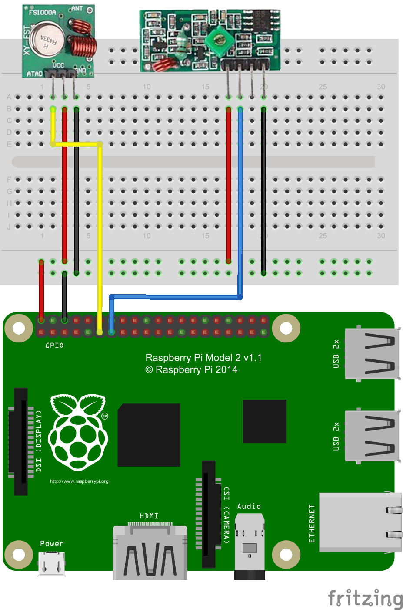

# Radio frequency (433/315Mhz) transmiter and reciver

Connect radio modules:

(Any other GPIO pin can be used for data)

Install WiringPi lib:
```bash
sudo apt-get update
sudo apt-get install git git-core
git clone git://git.drogon.net/wiringPi
cd wiringPi
./build
```

[Enable and configure modules in config file](serverConfig.md)

