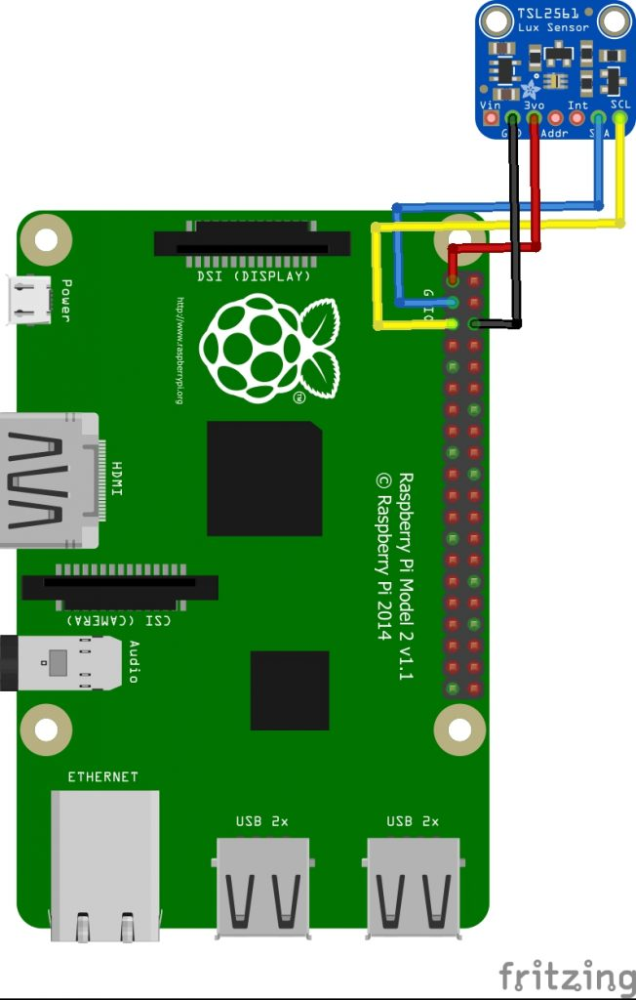

# TSL2561

Connect sensor to I2C:


## Configure i2c on the Raspberry Pi
```bash
sudo apt-get install i2c-tools python-smbus
```
Add the following lines to /boot/config.txt:
```bash
#i2c
dtparam=i2c_arm=on,i2c1=on
```
Edit the file /etc/modules and add the following line:
```bash
i2c-dev
``` 
Finally reboot:
```bash
sudo reboot
```
After the reboot you should be able to find the i2c device using the command below:
```bash
sudo i2cdetect -y 1
```

[Enable and configure sensor in config file](serverConfig.md)