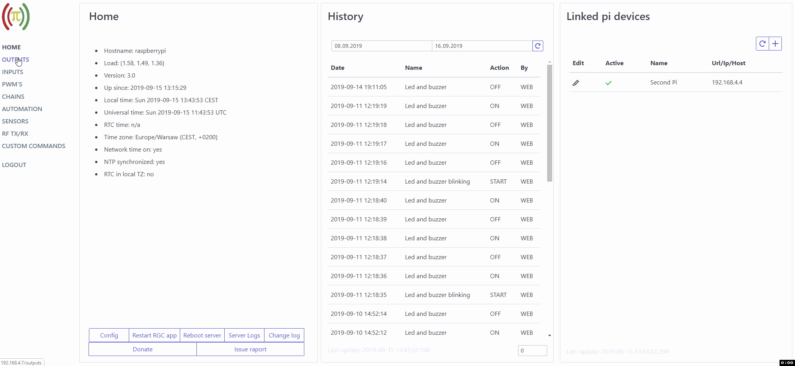
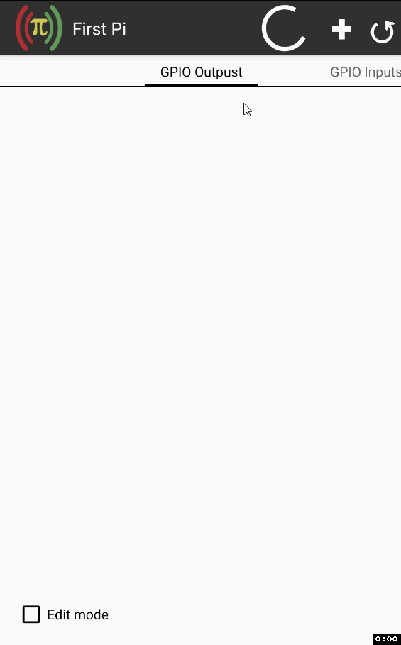

#** Remote GPIO Control**
Application allows control GPIO port on Pi devices via [android application client](https://play.google.com/store/apps/details?id=com.rgc) or build in www client.

## Main features
- Control the states of output pins
- Read the states of input pins
- Control software PWM output pins
- Link multiple pi devices
- Create sequential execution chains through all linked pi devices
- Define and run custom shell commands
- Read/store data from sensors 
    - build in support for:
        - [Temperature DS18B20](DS18B20.md) 
        - [Temperature and humidity DHT](DHT.md)*
        - [Luminosity Sensor TSL2561](TSL2561.md)
        - [Rotary encoder KY040](Rotary encoder.md)
        - [Range sensor HC-SR04](Range sensor.md)
    - custom sensor (create own script to return value)
- Transmit or recive radio frequency codes with generic [low-cost GPIO RF modules](RF.md)
- Create automated actions to change output/pwm, execude chain sequence, transmit RF or run custom command, such actions can have multiple triggers through all linked pi devices with custom conjunction
- Create android desktop widget for fast output change, read sensors value or execude chain sequence
- Setup android notification base on output/input status or sensor value

## Preview
### Web client preview

### Android client preview

## Support
Tested and working on Raspberry Pi devices with Raspiain OS.

Tested and working with Banana Pi devices with [this](https://github.com/BPI-SINOVOIP/RPi.GPIO) library.

Tested and working with Orange Pi Zero devices with [this](https://opi-gpio.readthedocs.io/en/latest/index.html) library.
(Import replacement from "import RPi.GPIO as GPIO" to "import OPi.GPIO as GPIO"  in file rgc-server.py is necessary)

Should work on similar devices/OS's but it requires a library [RPi.GPIO](https://pypi.python.org/pypi/RPi.GPIO) (Raspbian OS already has it) or another based on it. 

## License
Remote GPIO control server is available under the [MIT license](http://opensource.org/licenses/MIT).

## Donation
If you like this project please consider a donation:

