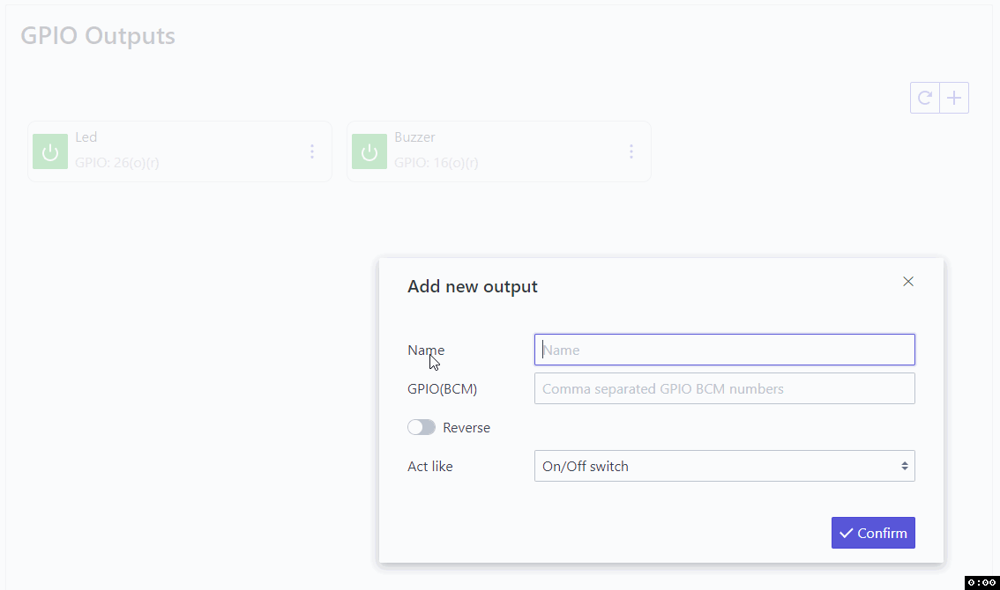
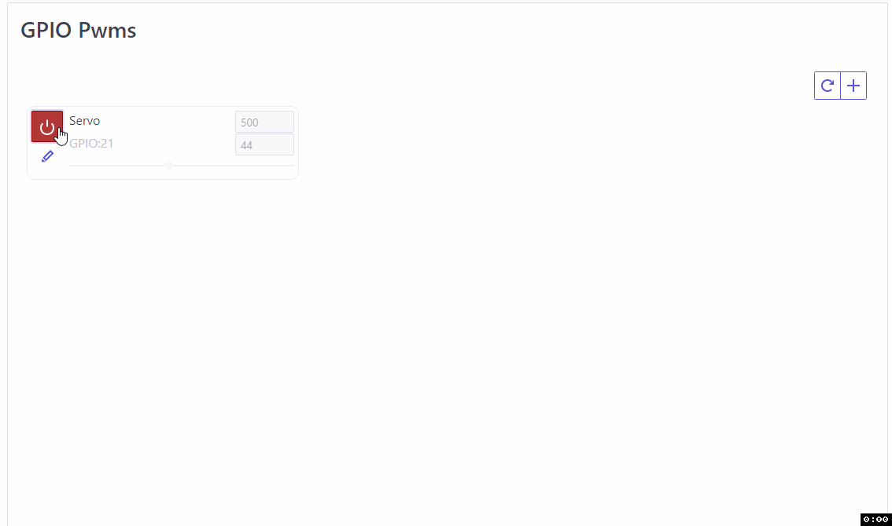
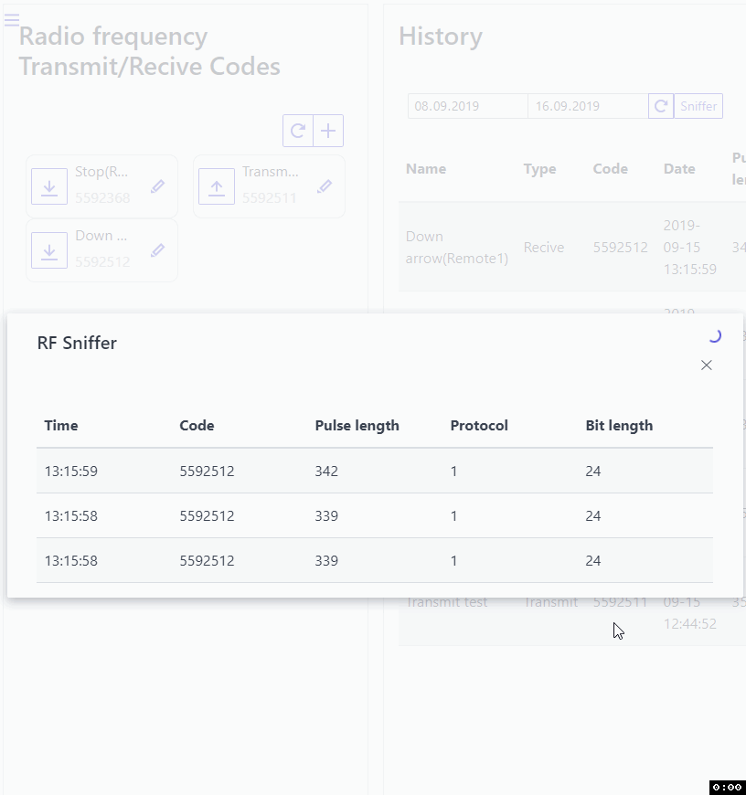

# Web Client
## GPIO Outputs


Example with led and buzzer connected.

Control GPIO outputs by setting state at LOW or HIGH.

Multiple pins can be used as one tile.
<details><summary>BCM Pinout</summary></details>

With reverse checkbox, colors of button can be reversed for LOW/HIGH state.

Tiles can be defined to act like:

- on/off switch (click will turn in on and next click will turn it off)
- pushbutton (click and hold will turn in on and release will turn it off)

## GPIO Inputs


Example with hardware pushbutton:


Read GPIO inputs state by color.

Single pin can be used for one tile.
<details><summary>BCM Pinout</summary></details>

With reverse checkbox, colors of button can be reversed for LOW/HIGH state.

## Software PWM Outputs


Example with servo connected.

Control Software PWM Outputs by turning PWM on or off, when turned on control frequency and duty cycle.

Multiple pins can be used as one tile.
<details><summary>BCM Pinout</summary></details>

With reverse checkbox, duty cycle slider can be placed up side down.

## Custom shell commands


Example with python file:
```python
import random
print random.randint(1,101)
```

Execute custom shell commands, this can be bash command or execution of script file in any language.
Result will be saved according to what script/command print/return.

With wait checkbox checked client will wait (in the same thread as execution) for result and print it, otherwise seperate thread will be created.

## Sensors


Example with DHT11, range and custom sensor.

Read predefined in [config](serverConfig.md) or custom sensors values.

If sensor is correctly defined in config and connected it will be automaticly listed here.

Custom sensor can be defined here.

Options:

- History save interval (seconds) - Defines how often the data from the sensor are to be save
- History range back (days) - Defines how big sensor log can be

For custom only:

- The unit will be displayed next to the value
- Gpio BCM (if custom sensor uses), it will prevent for that pins to used in other cases
- Data name - for info only
- Data source - it must be early defined with custom shell command (single execution must return only numeric value)

By selecting each sensors, values will be compared on chart.

## Radio frequency Transmit/Recive Codes

At least one module must be [connected](RF.md) and [configured](serverConfig.md) for this to work.

Each configured tile is seperate code for recive or transmit.

If code recive is detected it will be displayed in history, to transmit code click on configured tile.


### Sniffer

It can be used to sniff all transmited codes in area.

I push buttons in rf remote in below gif.



## Linked PI's

Link multiple pi devices (with rgc setup), this can be used for chains execution a cross them, or automation.

Both connections type (www or mobile) are supported.

## Chain sequences

Runs multiple actions(bonds) one by one with one click. Built sequence can be runned multiple times afer execution (Loop countdown), if value there is -1 then sequence will be repeted until cancelation. 

With <> icon execution order of bonds can be changed.

### Bonds

To use specific bond type, source must be first configured in separate tab or in linked device.

Bonds(actions) types:

- Output - to change GPIO output state
- PWM - to disalbe/enable, set DC, set Frequency of soft. PWM
- Automated action - to trigger conditions check of configured automated action, if conditions are met then action will run
- Transmit Radio Frequency code 
- Execude custom command
- Execude or cancel other chain

Each execution can be daleyed with specific time (seconds)

All actions can be runned on selected linked device, device must be online and rgc app active in time of configurtion and chain execution.

### Example 1 - Blinking led and buzzer


Example sets on and off early configured GPIO output until will be canceled.

## Automated actions

Configured action start automaticly when conditions(triggers) are met.

To use specific action type, source must be first configured in separate tab.

Actions types:

- Output - to change GPIO output state
- PWM - to disalbe/enable, set DC, set Frequency of soft. PWM
- Transmit Radio Frequency code 
- Execude custom command
- Execude or cancel other chain

Number of executions can be limited by any number, -1 - unlimited.

Checkbox keep logs - if checked executed action will be saved in history log.

Triggers(conditions) will be checked every x seconds configured in "Thread refresh rate". By defult its 0,3s, you can increase this value if such reaction is not needed or if cpu usage is high.

### Triggers

To use specific trigger, source must be first configured in separate tab or in linked device.

Triggers types:

- Exact date time
- Time of day
- Timer
- Week day
- Sensor value
- Input/Output state
- PWM state
- PWM frequency
- PWM dutycycle
- Run only in chain (if action will be used in chain sequence execution)
- Ping
- Recive RF
- Custom command output
- Linked Input/Output state
- Linked Sensor value
- Linked Recive RF

Most triggers types have configurable operator, example of use can be sensor value to trigger action when selected sensor value is bigger then 20 (eg. Sensor value > 20).

### Conjunction pattern

If there is more then one trigger per action, conjunction pattern can be set. 

By default all triggers conditions must be fulfilled in the same time for action to run. ('#1# and #2#' etc.)

Each trigger is a number in pattern (#trigger number#), we can use python conjunction syntax to enter patten of our own. 

For example we have three triggers and we want to run action if at least one of them is activeted then pattern will be: #1# or #2# or #3#

### Example 1 - Alarm when smoke detected


Alarm (early configured chain of blinking led and buzzer) will go on when smoke sensor (confugired on second linked pi device) change state. 

Action is also limited to run only beetwen 2:00 and 9:00 o'clock.

# Android Client
## Connection

To connect to the server, connection must be first configured.


Make sure that address and port of the server are accesable from network witch phone is connected !

## Widgets

Avalible widgets are:

- On/off GPIO output switcher
- Sensors reader
- Chains sequence executioner


## Notifications

Android client can push notification when:

- GPIO output or input change state
- Sensor reach configured value

When 'precise' checkbox is checked, condition will alwes be cheked every interval(field) seconds. (This option can drain battery beceause phone can never enter to sleep mode). Without it condition will be checked as others aplications (15min/30min/12h/24h).

### Example 1 - Notification when smoke detected

Android will notify if smoke(GPIO Input) is detected, with this configuration delay is max 15min.


